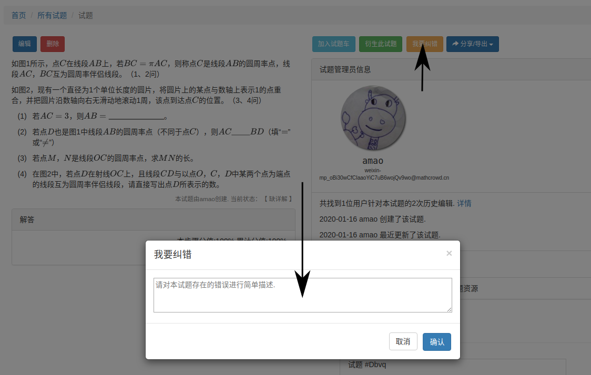
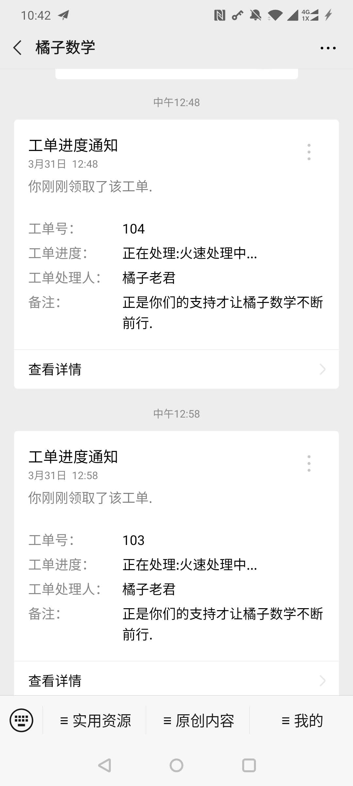
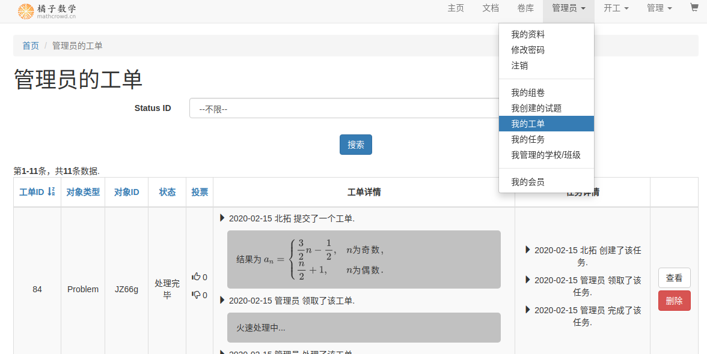

.. _issue:

============
纠错工单
============

提交工单
-----------------

进入 ``试题详情`` 页面( 见 :ref:`problem_detail` )，点击 ``我要纠错`` ，弹出纠错工单输入框，输入试题或解析存在的问题.

处理工单
------------------

若用户提交纠错工单的试题已被认领，则该试题的管理员就会收到一条通知：

此时管理员需要登录橘子数学网站, 点击 ``用户昵称`` -> ``我的工单`` 查看待处理工单：

领取工单
--------------------

对于尚无人认领的试题，若有纠错工单创建，则进入代认领的工单列表. 认证用户登录橘子数学网站，点击 ``开工`` -> ``我要领工单`` 进行认领.
认领并完成工单后即成为该试题的管理员.

退回工单
---------------------

让试题管理员不想处理自动认领的纠错工单可以退回工单，或者长时间未处理认领的订单系统会默认用户退回了工单，需要注意的是，一旦后退回工单，
该用户即不再是该试题的管理员，相关奖励将会从用户账户中扣除，该试题的工单将重新进入待认领工单列表.
