.. _problem_edit:

===========
试题编辑
===========

.. _problem_detail:

试题详情
-------------

.. seealso:: 名词解释: :ref:`problem_definition`

* 从 ``试题车`` 或 ``组卷详情`` 查看 ``试题详情`` 页面.

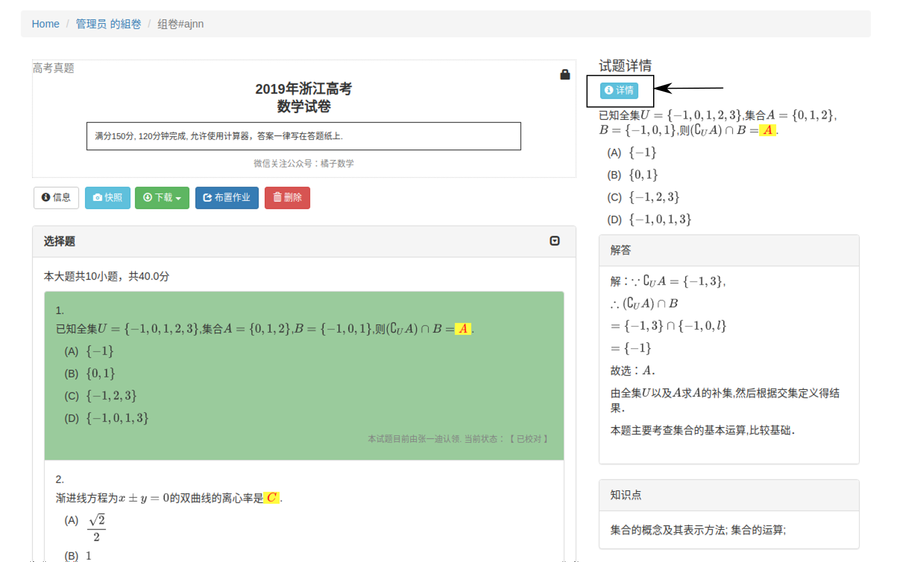

* 从 ``试题检索`` 查看 ``试题详情`` 页面.

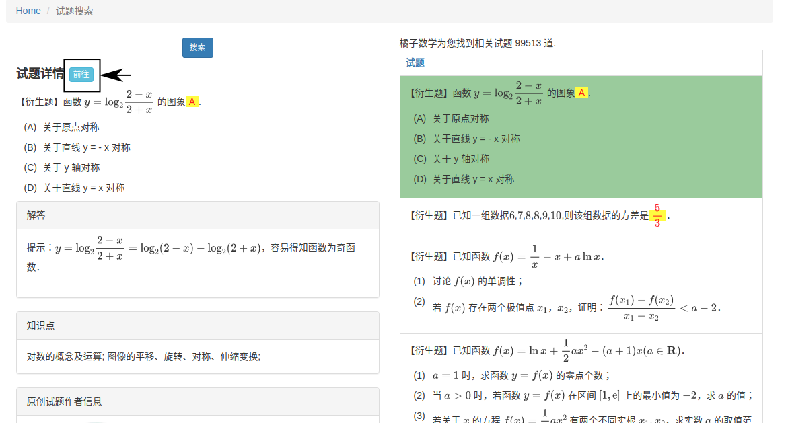

.. _problem_copy:

衍生试题
--------

.. seealso:: 名词解释: :ref:`problem_copy_definition`

从 ``试题详情`` 页面( 见 :ref:`problem_detail` ) 点击右上方 ``创建副本`` 按钮,  创建该试题的副本并进入 ``试题编辑`` 页面.

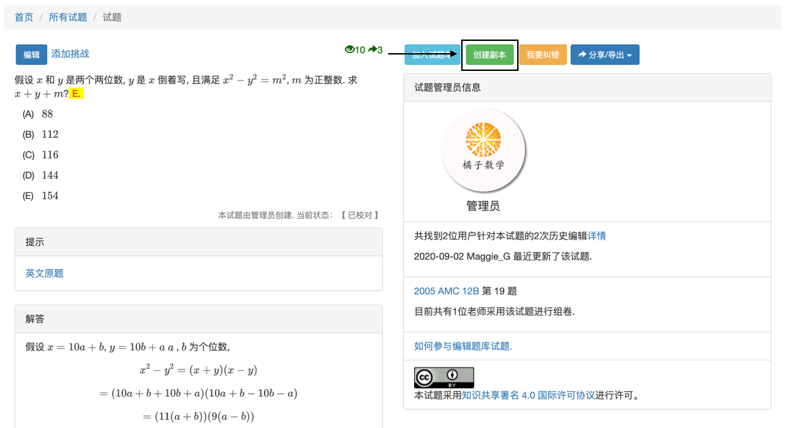

.. note:: 用户创建的试题副本, 可以在 ``我创建的试题`` ( 见 :ref:`problem_create` )列表中找到.

编辑试题
-----------

从 ``试题详情`` 页面( 见 :ref:`problem_detail` ) 点击左上方 ``编辑`` 按钮,  进入 ``试题编辑`` 页面.

.. note::
    #. 用户仅能编辑自己创建或认领的试题, 没有编辑权限的情况下可以衍生试题进行修改( 见 :ref:`problem_copy` )；
    #. 用户需使用 :math:`\LaTeX` 输入数学公式, 编辑时可在右侧获得公式的预览反馈( 见 :ref:`latex_tutorial` ).

-----------
题型及题目
-----------

.. seealso:: 相关说明 :ref:`problem_type_definition`

在 ``试题编辑`` 页面, 使用 ``::question::[type=n]`` 选择题型, 其中 ``n`` 的值等于 ``0,1,2`` 时分别表示 ``填空题,选择题,解答题`` .

* 根据不同题型输入题目文本, 答案格式为： ``[[144]]`` (以填空题答案144为例). 

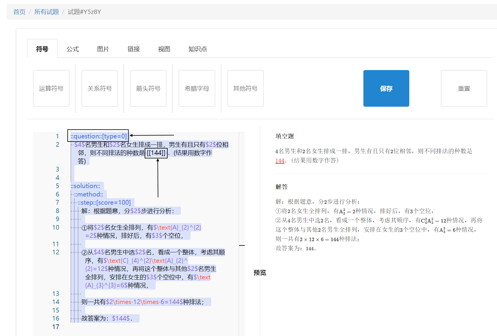

* 选择题选项的格式为: ``A.`` , 注意选项只能是2-6个选项.

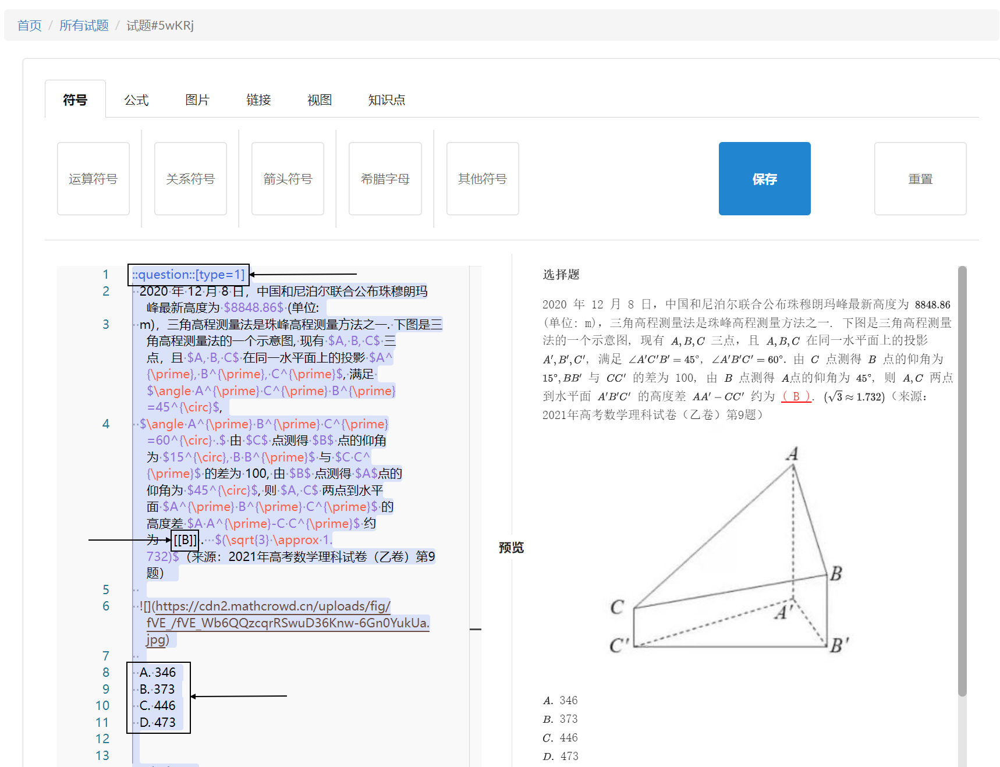

-----------
符号
-----------

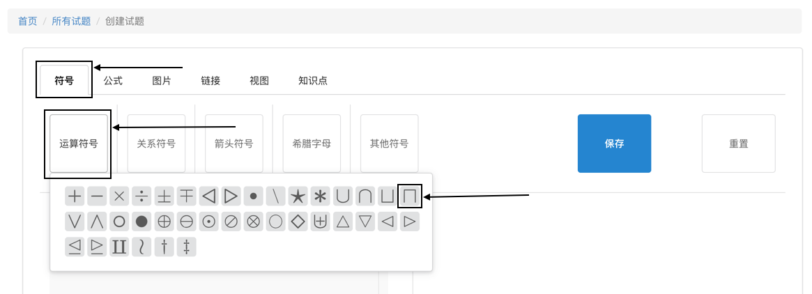

点击 ``符号``, 将鼠标悬停在下方选项后单击图片可插入指定符号.

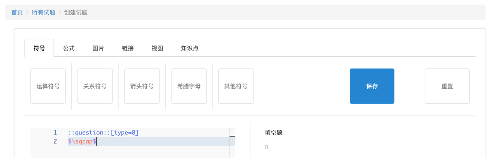

-----------
公式
-----------

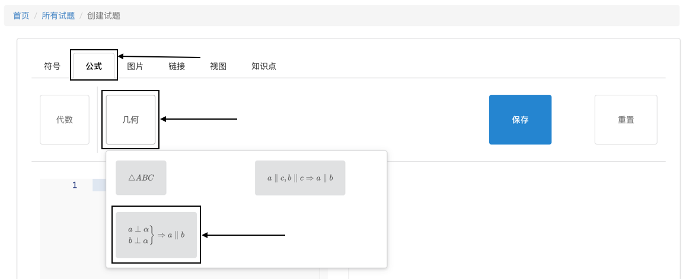

点击 ``公式``, 将鼠标悬停在下方选项后单击图片可插入指定公式.

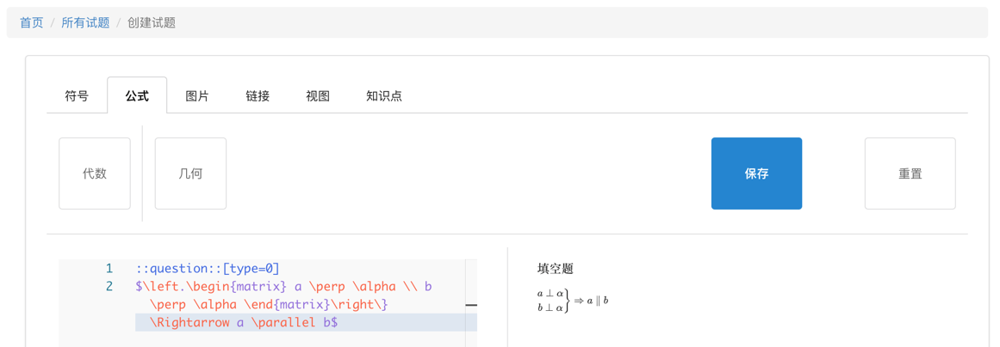

-----------
图片
-----------

点击 ``图片``, 拖放或点击添加图片.

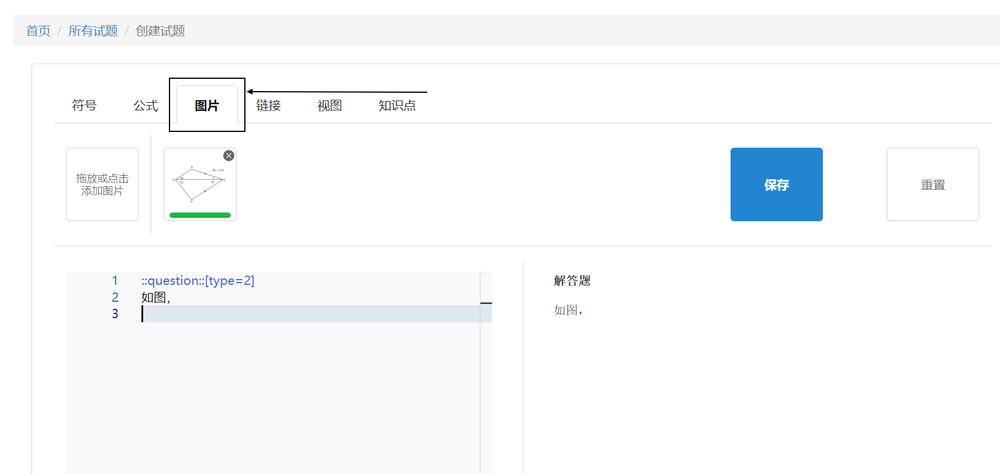

光标停留到需要插入图片的位置, 此时, 点击已上传的图片即可插入图片.

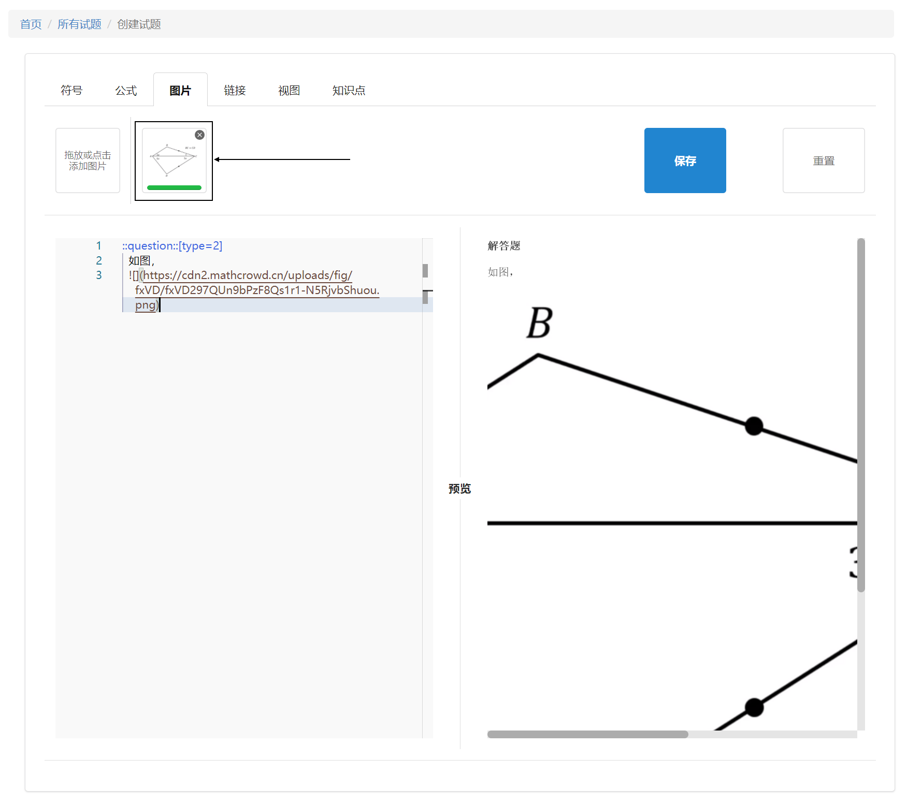

-----------
链接
-----------

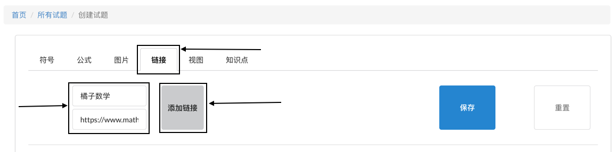

点击 ``链接``, 输入正确的内容和网址后点击 ``添加链接``.

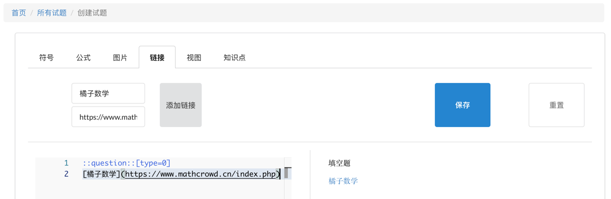

-----------
视图
-----------

点击 ``视图``, 选择不同视图可更改下方预览区样式.

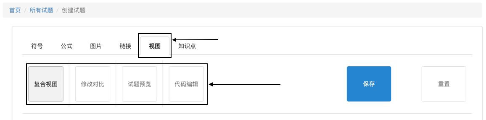

* 复合视图：预览区左边为代码编辑区域, 右边为试题预览区域.

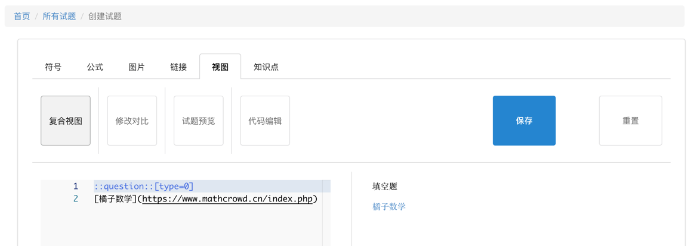

* 修改对比：可查看本次编辑修改的内容, 左边为修改前代码, 右边为修改后代码.

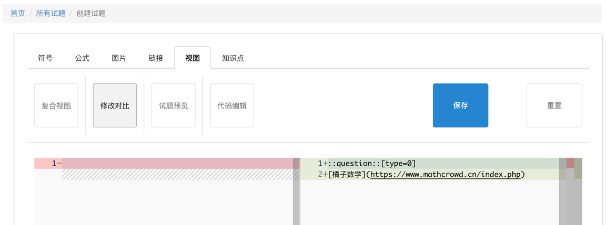

* 试题预览：预览区显示试题预览.

* 代码编辑：预览区显示试题代码.

-----------
知识点
-----------

点击 ``知识点``, 选择合适的知识点.

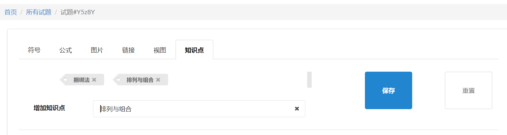

-----------
解析
-----------

.. seealso:: 相关说明 :ref:`problem_solution_definition`

在 ``试题编辑`` 页面, 

* 使用 ``::hint::`` 增加针对该试题的提示;

* 使用 ``::solution::`` 增加该试题的解析;

* 使用 ``::method::`` 新增一种解法;

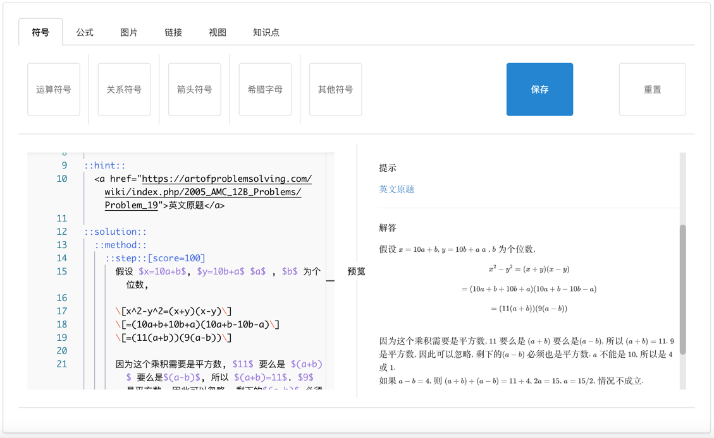

* 在某解法中使用 ``::step::`` 在该解法中追加一个步骤,  并使用 ``[score=n]`` 设置该步骤的分值; ``n`` 的值可以是0到100的整数,也可以是分数.

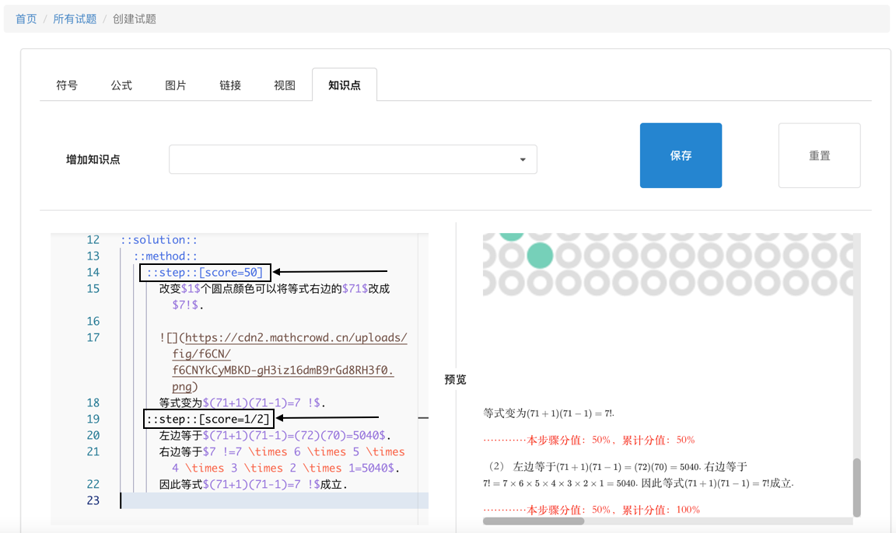

-----------
保存与重置
-----------

* 完成编辑并确认无误后, 点击 ``保存`` , 点击 ``确定``, 可以保存试题.

* 点击 ``重置`` , 试题恢复修改前内容.

.. _problem_create:

创建试题
----------

在 ``试题车`` 页面( 见 :ref:`cart_view` ), 点击 ``录入试题`` 按钮, 创建新试题并转到编辑页面.

.. image:: ../_static/problem_create.png
    :width: 400px

当用户保存后, 可在导航栏打开 ``用户昵称`` 下拉菜单, 单击 ``我创建的试题`` 获取所创建的试题列表.

    .. image:: ../_static/my_problem.png
        :width: 400px

申请原创
----------

在 ``试题详情`` 页面( 见 :ref:`problem_detail`), 点击 ``申请原创`` 按钮, 该试题将得到原创保护.

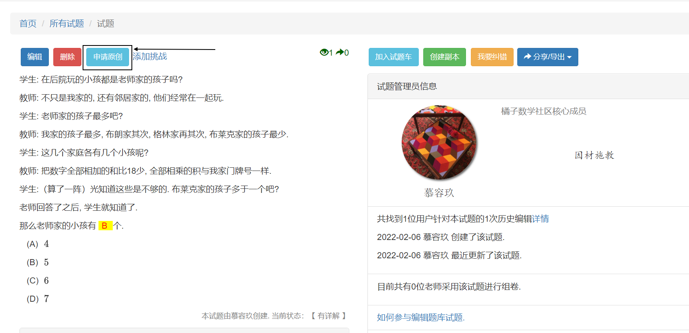
