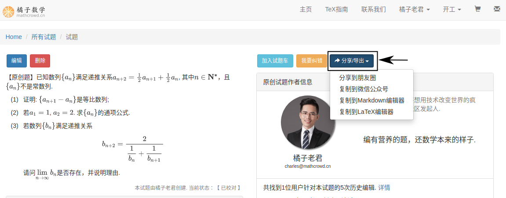
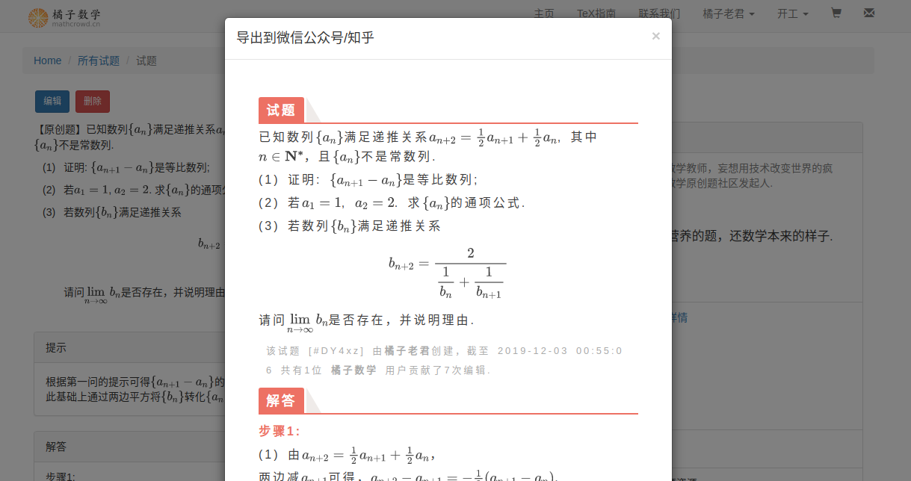
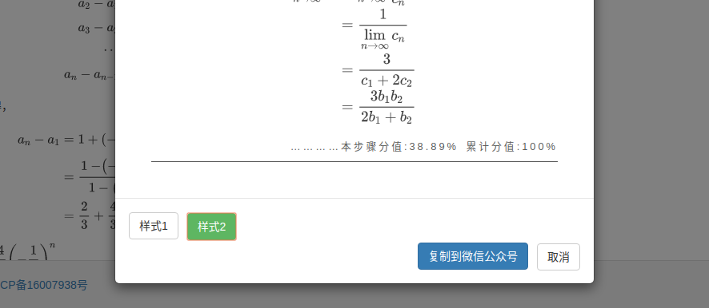
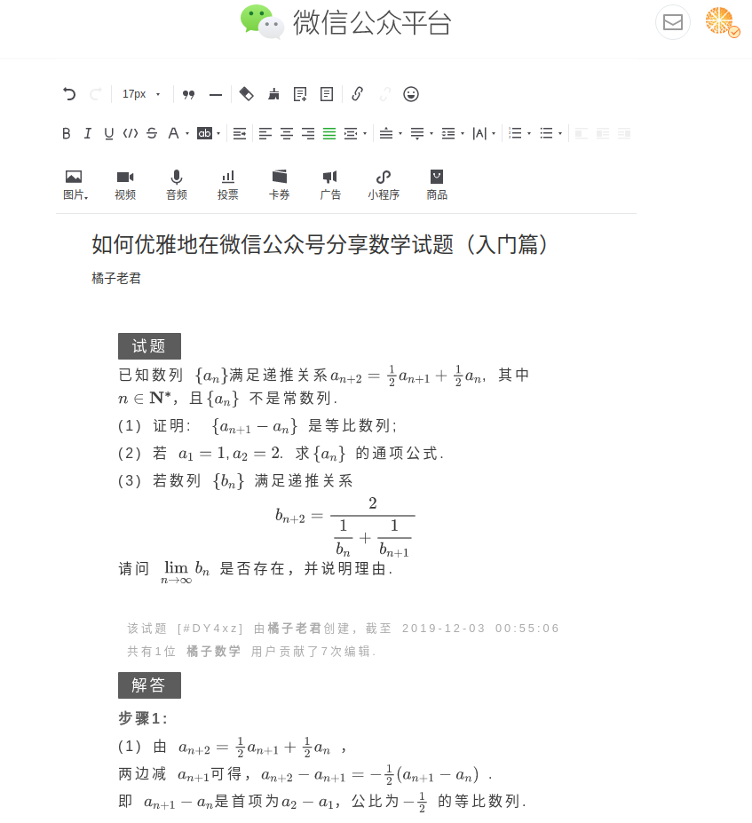

.. _problem_share:

=========
分享试题
=========

进入 ``试题详情`` 页面( 见 :ref:`problem_detail` )，点击 ``分享/导出`` 下拉菜单.

------------------
分享到朋友圈
------------------

选择 ``分享到朋友圈``，手机打开微信扫描二维码后即可分享试题链接到朋友圈.

------------------
分享到微信公众号
------------------

选择 ``复制到微信公众号``，弹出预览窗口.

滚动到弹出窗口的底部，选择需要的 ``样式`` ( 见 :ref:`customized_css` ).

点击弹窗底部 ``复制到微信公众号`` 按钮，前往微信公众号图文编辑页面 ``ctrl+v`` 粘贴即可.

------------------
分享到知乎
------------------

即将上线

------------------
分享到第三方编辑器
------------------

为了满足用户更多地定制化需求，橘子数学也支持用户将试题车导出为 **markdown** 或 :math:`\TeX` 分享到第三方编辑器进行编辑.

推荐的 **markdown** 编辑器：

* `Typora <https://www.typora.io/>`_: 最像word的 **markdown** 编辑器.

* `Markdown Nice <https://mdnice.com/>`_: 优秀的国内开源在线 **markdown** 编辑器.

* `StackEdit <https://stackedit.io/>`_: StackExchange 出品的开源在线 **markdown** 编辑器.

推荐的 :math:`\TeX` 的编辑器:

* `Overleaf <https://www.overleaf.com/>`_: 国外流行的在线 :math:`\TeX` 编辑器，可以实现在线编译.

* `TeXStudio <https://www.texstudio.org/>`_: 最好用的 :math:`\TeX` ，需要安装 `TeXLive <https://www.tug.org/texlive/>`_ 才能正常编译.

.. warning:: 由橘子数学导出的 :math:`\TeX` 代码中包含大量自定义环境，建议使用 **BHCexam** 宏包进行编译.

相关链接:

* :ref:`bhcexam`

