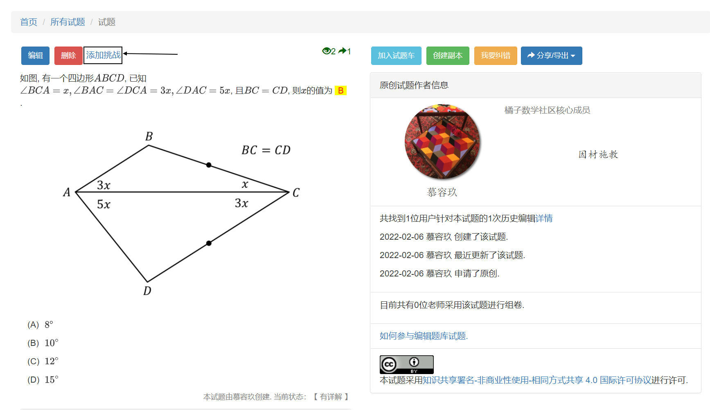
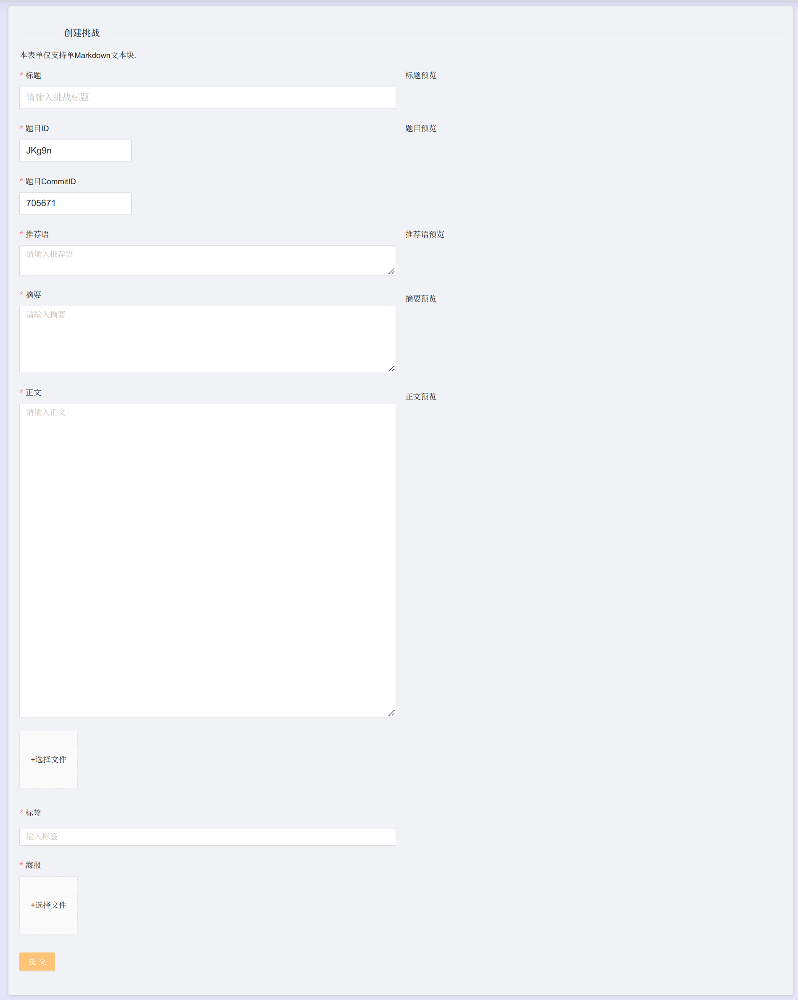
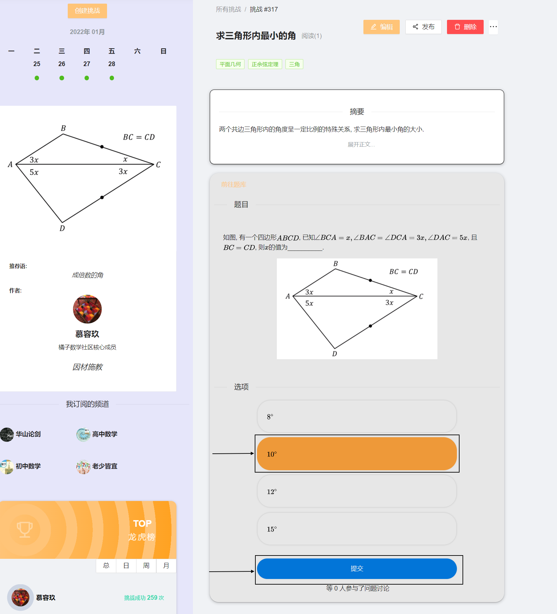
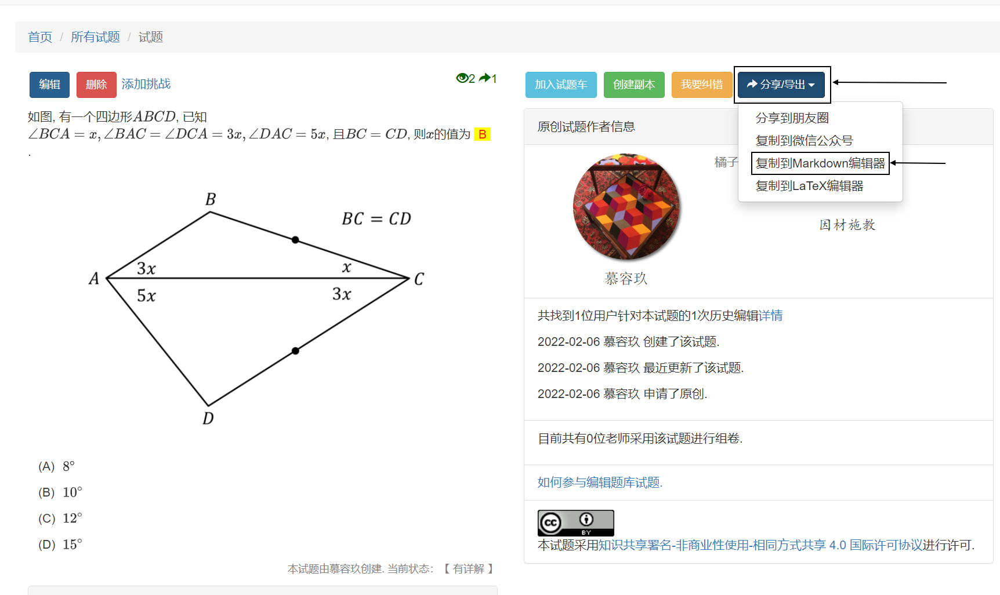
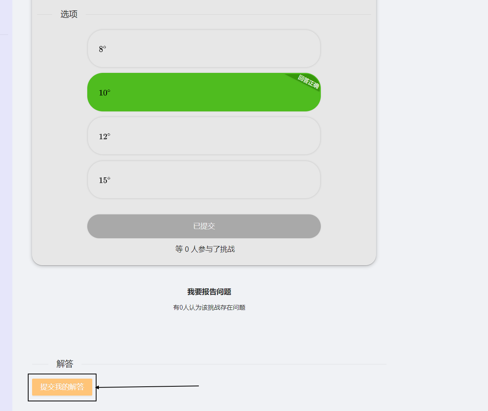
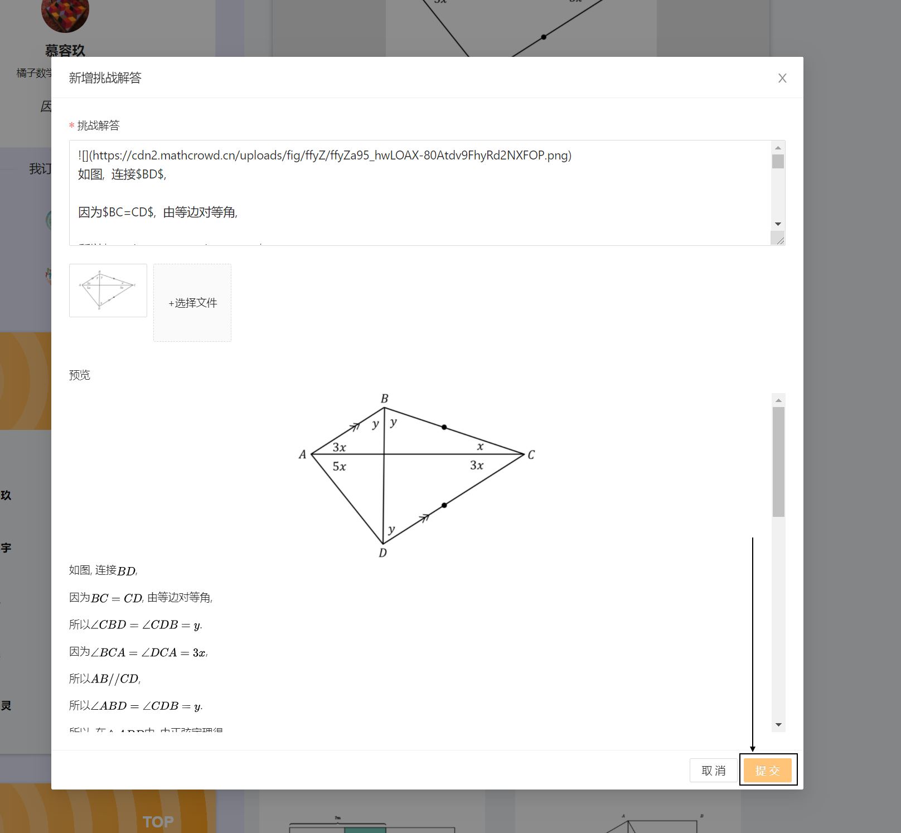

.. _puzzle_edit:

===========
挑战题编辑
===========

.. _puzzle_create:

创建挑战题
-------------

在 ``试题详情`` 页面, 点击 ``添加挑战`` .

编辑挑战题
-------------

-----------
挑战题模块
-----------

在挑战题编辑页面, 填写相应模块内容： ``标题`` , ``推荐语`` ,  ``摘要`` ,  ``正文`` ,  ``标签`` ,  ``海报``, 确认无误后, 最后点击 ``提交`` , 等待页面跳转.

-----------
挑战题答案
-----------

* 挑战题预览页面, 根据答案选择正确的选项, 点击 ``提交`` .

* 点击 ``前往题库`` , 在跳转的 ``试题详情`` 页面, 点击 ``分享/导出`` , 点击 ``复制到markdown编辑器``.

* 回到挑战题预览页面, 点击 ``提交我的解答``

* 在弹出的窗口, 粘贴, 删除多余的内容, 留下答案, 点击 ``提交`` 

