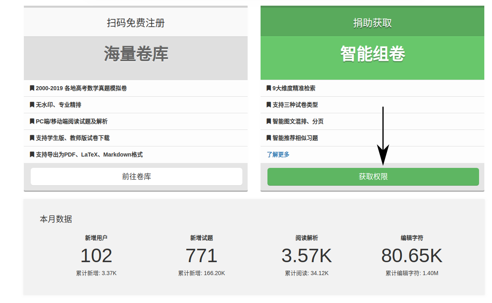
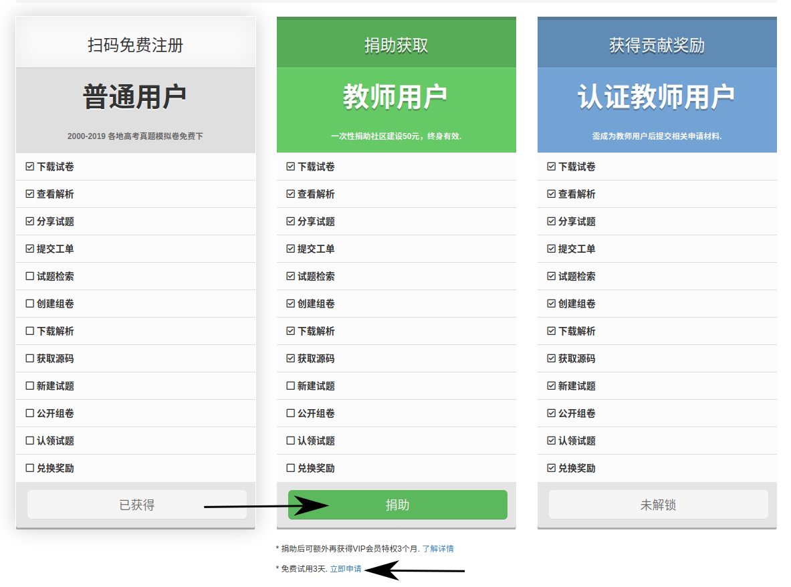
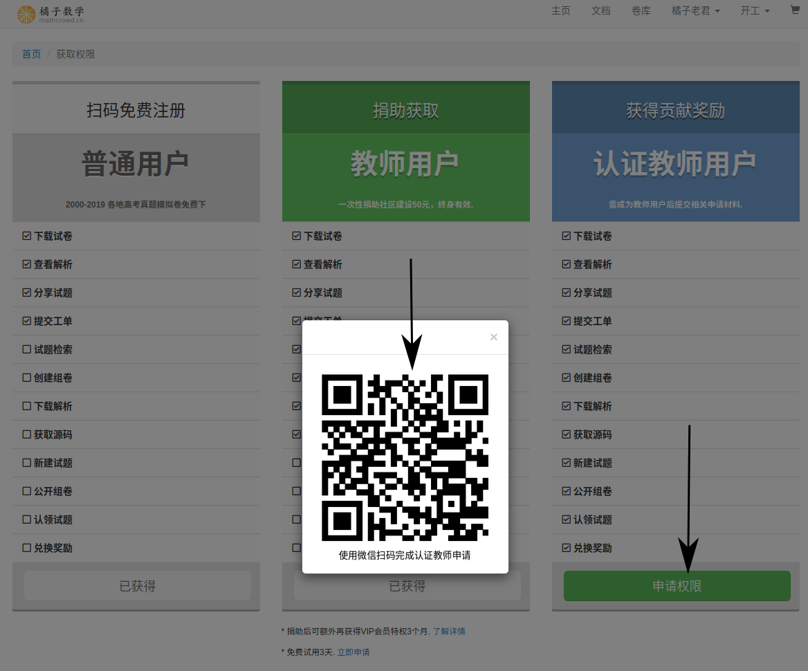
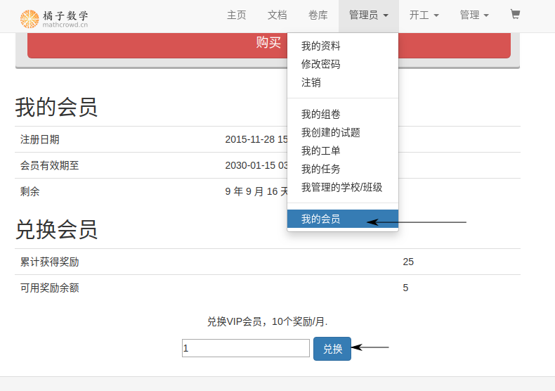

.. _apply_role:

==============================
获取权限及网站VIP
==============================

.. _user_rbac:

权限说明
-----------------

普通用户、教师用户、认证教师用户
=====================================

+-----------+---------+---------+----------------+
| 用户权益  | 普通用户| 教师用户|   认证教师用户 |
+-----------+---------+---------+----------------+
| 下载试卷  |   ✓     |    ✓    |         ✓      |
+-----------+---------+---------+----------------+
| 查看解析  |   ✓     |    ✓    |         ✓      |
+-----------+---------+---------+----------------+
| 分享试题  |   ✓     |    ✓    |         ✓      |
+-----------+---------+---------+----------------+
| 提交工单  |   ✓     |    ✓    |         ✓      |
+-----------+---------+---------+----------------+
| 试题检索  |   ×     |    ✓    |         ✓      |
+-----------+---------+---------+----------------+
| 创建组卷  |   ×     |    ✓    |         ✓      |
+-----------+---------+---------+----------------+
| 下载解析  |   ×     |    ✓    |         ✓      |
+-----------+---------+---------+----------------+
| 获取源码  |   ×     |    ✓    |         ✓      |
+-----------+---------+---------+----------------+
| 新建试题  |   ×     |    ×    |         ✓      |
+-----------+---------+---------+----------------+
| 公开组卷  |   ×     |    ×    |         ✓      |
+-----------+---------+---------+----------------+
| 认领试题  |   ×     |    ×    |         ✓      |
+-----------+---------+---------+----------------+
| 兑换奖励  |   ×     |    ×    |         ✓      |
+-----------+---------+---------+----------------+

普通会员、VIP会员
=====================================

+--------------------------+----------------+----------------+
| 相关功能限制             |   普通会员     |     VIP用户    |
+--------------------------+----------------+----------------+
| 每日访问解析数限制       |      30        |      200       |
+--------------------------+----------------+----------------+
| 每日下载组卷数限制       |      2         |      10        |
+--------------------------+----------------+----------------+
| 每日获取试题源码限制     |      5         |      30        |
+--------------------------+----------------+----------------+
| 电脑端阅读原创试题解析   |     受限       |     不受限     |
+--------------------------+----------------+----------------+

获取权限
--------------------------

* 电脑登录橘子数学网站(https://www.mathcrowd.cn)首页，点击“获取权限按钮”.

获取教师权限
=========================

* 捐助50元获得终生教师权限，同时可额外获得3个月的VIP;

.. seealso:: :ref:`about_donation`

* 点击试用，可申请试用教师权限三天，(到期后可重新申请).

.. _apply_identified_role:

成为认证教师
============================

* 当成为教师权限后，方可自助申请成为认证教师：

.. _exchange_vip:

兑换VIP
================================

* 当成为认证教师后，就可以参与试题编辑获得奖励，并用奖励兑换VIP.

注意：输入框内填的数字是需要兑换的月数.