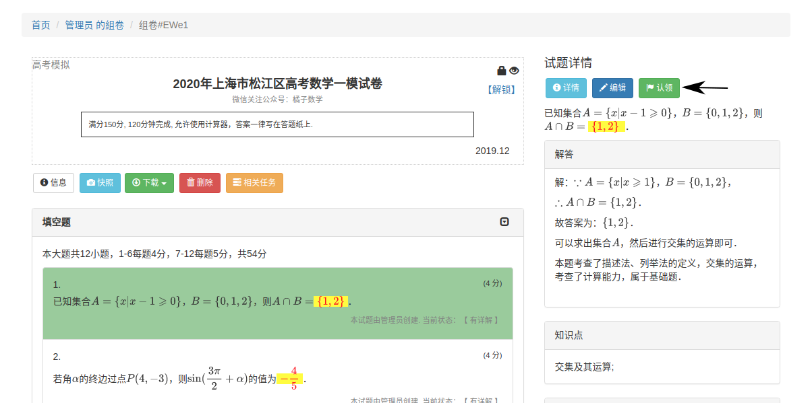
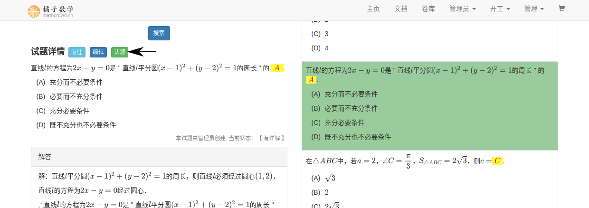
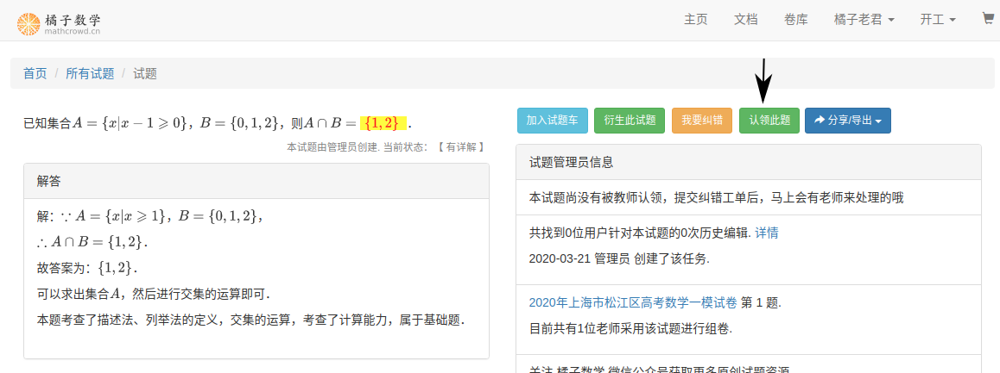
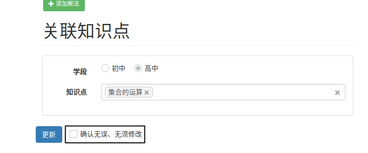

.. _take_mission:

###################
试题任务
###################

橘子数学社区中的试题均由认证教师成员认领并负责编辑。

.. seealso:: :ref:`apply_identified_role`

.. note:: 未被认领的试题，当题源为中高考模拟时，可以直接认领. 若不是，则可以先提交纠错工单后再认领. :ref:`issue`

认领试题
--------------------

认证教师可以在 ``试题详情`` 、``试题检索`` 、``组卷详情`` 页面后 ，点击 ``认领试题`` 认领试题.

* ``组卷详情`` 页面

* ``试题检索`` 页面

* ``试题详情`` 页面

完成编辑
--------------------

* 点击 ``编辑`` ，进入试题编辑页面，提交前打勾即把试题任务标记为已完成，可以获得相应奖励.

.. seealso:: :ref:`problem_edit`

负责纠错
--------------------

* 当所认领的试题收到纠错工单时，试题任务将重新标记为待完成，任务对应的奖励将冻结，完成编辑后重新后解冻.

.. seealso:: :ref:`issue`

获得奖励
--------------------

* 点击 ``用户昵称`` -> ``我的任务`` 查询累计获得的奖励及当前可用的奖励.

* 目前，奖励可兑换网站的VIP会员.

.. seealso:: :ref:`exchange_vip`

