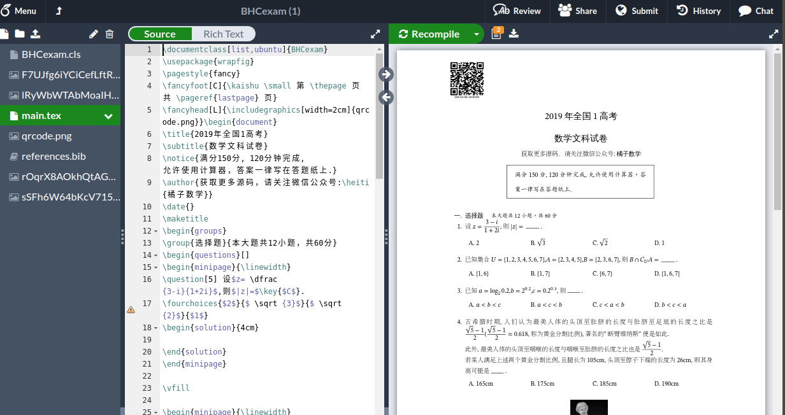

.. _how_to_compile_mathcrowd_tex:

================================================================================
如何编译橘子数学的 .tex 文件
================================================================================

.. warning:: 网站后台提供了在线编译功能，即组卷完成后即可下载编译好的教师版和学生版PDF. 所以并没有必要进行本地编译，但网站还是提供了试卷tex文件的下载以方便LaTeX爱好者按照自己的需求对试卷的版式进行微调. 但并不建议初学者轻易尝试，因为你可能耗费大量时间应付各种编译出错.

下载 .tex 源文件
------------------------------

下载试卷源码.zip文件并解压缩.

.. seealso:: 参见 :ref:`download_worksheet`

.. code-block:: bash

    # unzip 2020年上海市松江区高考数学一模试卷学生版.zip

    2020年上海市松江区高考数学一模试卷学生版
    ├── 5aIativVY0G2jNfzNbq3Lda8hv7orgSG.png
    ├── 5BQ4VyS9vwSGM75nCceitkpllTNpCkFE.png
    ├── 5SoNOoN7iDp4tfDLgSQXYfbH9WqAMREK.png
    ├── BHCexam.cls
    ├── paper.tex
    ├── qrcode.png
    └── xP2JdxhvQemwApl0JlaMyHA6cvkrr0lT.png

编译文件
----------------------

本地编译（推荐）
=======================

本地安装 TexLive 套件 和 TeXstudio 编辑器，打开 paper.tex 进行本地编译.

.. seealso:: **经验分享:** :ref:`how_to_install_texlive` :ref:`texstudio`

在线编译
=========================

将解压后的所有文件上传至 Overleaf ，在线编译 paper.tex .

.. seealso:: **经验分享:** :ref:`overleaf_guide`

常见编译错误
-------------------------------

.. seealso:: 参见 :ref:`common_error`
