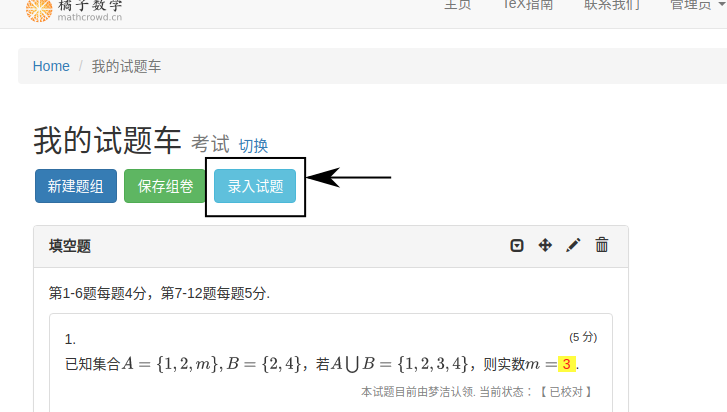

=================================
如何在橘子数学题库录入试题？
=================================

创建试题
----------

在 ``试题车`` 页面( 见 :ref:`cart_view` )，点击 ``录入试题`` 按钮，创建新试题并转到编辑页面.

当用户保存试题后，可在导航栏打开 ``用户昵称`` 下拉菜单，单击 ``我创建的试题`` 获取所创建的试题列表.

    .. image:: ../_static/my_problem.png
        :width: 400px

选择题型
----------

