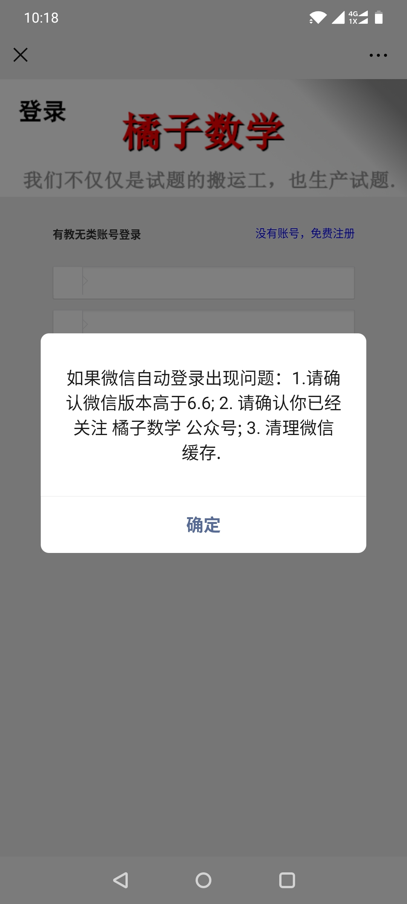
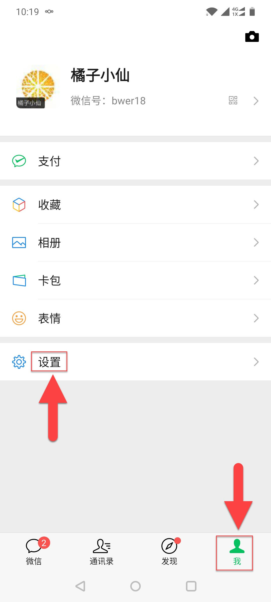
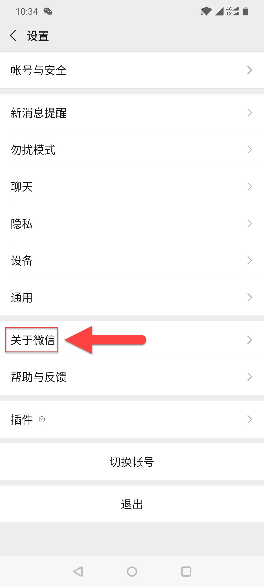
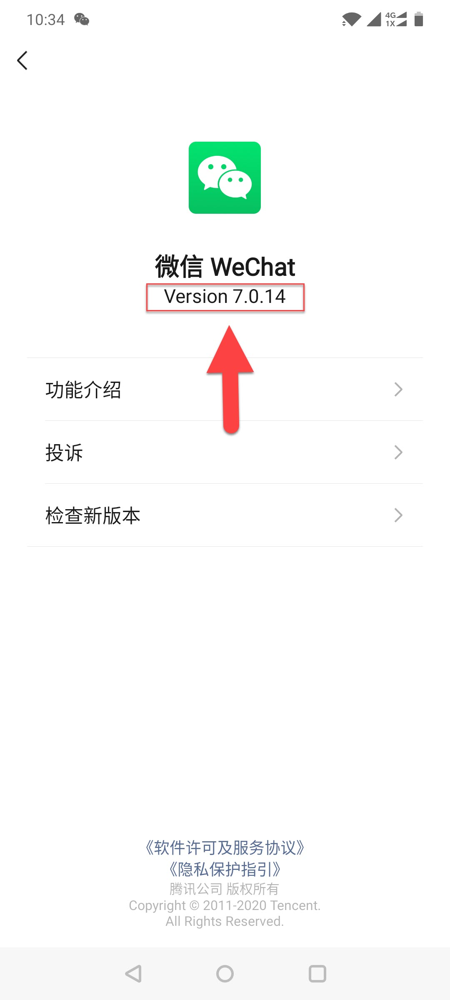
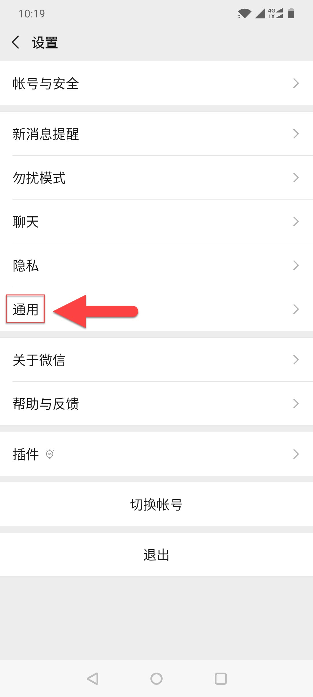
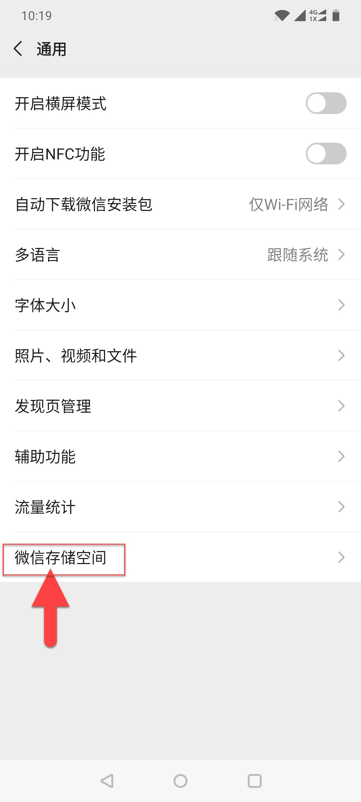
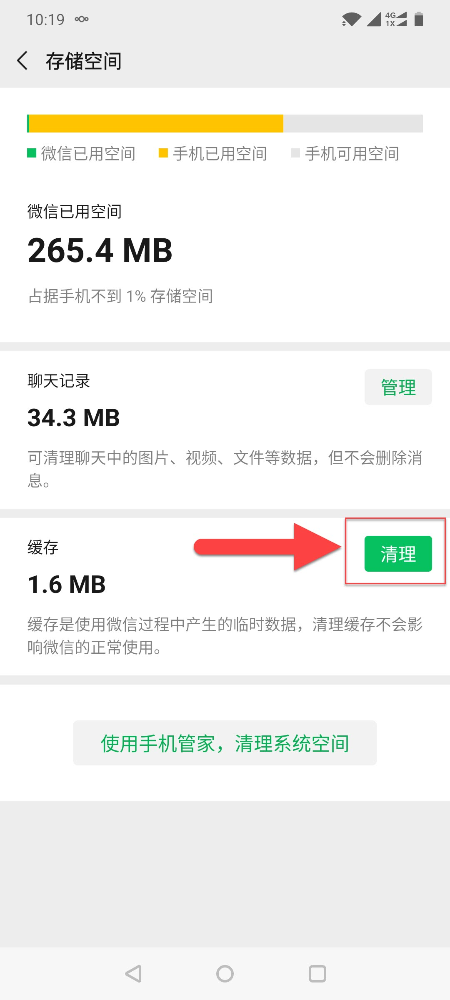

####################
手机微信登录排错指南
####################

当在手机微信APP中访问橘子数学网站时会弹出以下页面，正常情况下点击确定即可完成登录.

若自动登录出错，请查看下述操作进行排错:

保证微信APP为新版本
---------------------

你可以通过以下操作查看微信版本号并检查更新：

清理微信缓存
----------------------

如果你已经安装了最新版本的微信APP，那么请通过以下操作清理微信的临时文件缓存.

