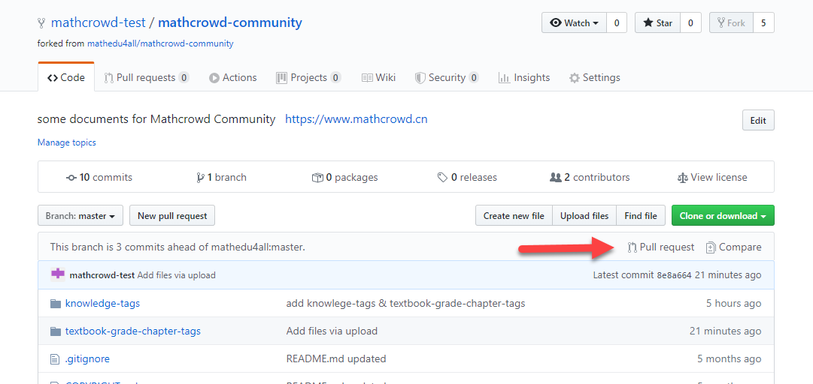

如何使用Github进行协作编辑
==========================

本教程以使用Github参与知识点梳理为例.

注册Github账号
--------------------------

`注册Github <https://github.com/join?source=header-home>`_ , 根据提示前往邮箱收取验证邮件点击"验证"按钮.

关注并Fork项目
---------------------------

访问 mathcrowd-community 项目页，从左到右，点击 ``Watch`` 关注项目， 点击 ``Star`` 收藏项目, 点击 ``Fork`` 生成该项目的副本.

点击 ``Fork`` 页面自动跳转至刚刚创建的项目分支副本，在其中找到需要编辑的文件.

在项目分支中通过网页编辑Markdown文件
------------------------------------

比如我们需要编辑方程与代数板块下的知识点, 那么我们找到 ``knowledge-tags/knowledge-nodes-algebra.md`` 文件, 点击编辑图标.

.. note:: 这里 ``.md`` 文件为 Markdown文件， 其中 ``*`` 开始一项无序列表项目. 通过缩进两个空格表示上下层级关系. 注意 ``*`` 后需要添加空格，同一级项目的缩进量保持相同.

编辑完成后，点击 ``Commit`` 提交这次编辑.

.. note:: 这里 ``Commit`` 只是在项目分支中提交，并不会变更主项目中的文件.

在项目分支中通过上传文件修改CSV文件
----------------------------------------

比如我们需要创建一个高中数学人教A版的教材章节信息文件，那么我们找到 ``textbook-grade-chapter-tags/example.csv`` 这个样例文件. 右键 ``raw`` 选择链接另存为，保存文件时添加后缀名为 ``.csv``.

下载完成后，双击用 Excel 打开进行编辑.

编辑完成后重命名为 ``高中-人教A.csv`` , 并上传到 ``textbook-grade-chapter-tags`` 后点击 ``Commit`` 提交.

将项目合并到主项目
-----------------------------

此时在项目分支的首页，会提示已经比主项目领先若干次Commit, 点击右侧 ``Pull request`` .

在确认发生变化的文件后，点击 `` Create pull request ``， 提交合并请求.

如何在Github上进行讨论
----------------------------

当确定方程与代数板块下的三级及以下知识点后，你希望听取其他用户的意见建议. 此时可以把相关内容复制到主项目 Issues 区中的相关 Issue, 与其他用户进行留言互动.

