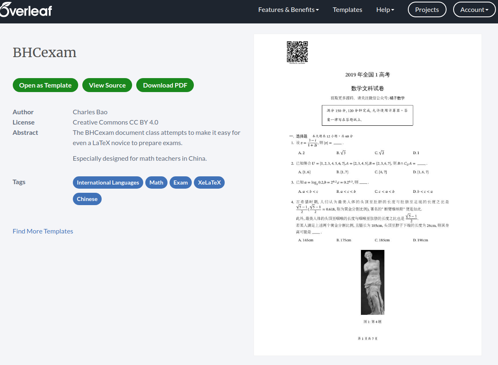
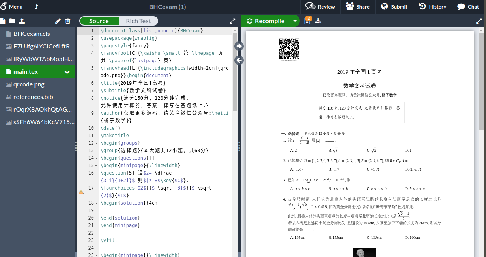

.. _overleaf_guide:

#####################
Overleaf 简明教程
#####################

Overleaf_ 是一款在线的 :math:`\LaTeX` 编辑工具.使用 Overleaf_ 在线编译 :math:`\LaTeX` 代码有如下好处:

- 可以省去本地安装和配置 :ref:`TeXLive <how_to_install_texlive>` 的问题.
- 可以在线管理自己的代码
- 可以实时预览代码,且有丰富的代码提示

Overleaf_ 大陆地区网址: https://cn.overleaf.com

注册&登陆
==============
点击上方网址进入 Overleaf_ 页面,第一次登陆时点击页面下方的注册,输入邮箱和密码后在邮箱点击确认链接即可完成注册.
也可以使用 ``Google`` 邮箱直接登陆.

.. hint:: 因服务器原因,登陆可能比较慢,加载时耐心等待即可. 

新建项目
===============

Overleaf_ 中的项目相当于本地的文件夹,一个项目相当于一个文件夹,将一份课件所需要的所有内容都放到该项目下,方便分类管理.

登陆后,点击页面左上方的 ``创建新项目`` ,选择 ``空白项目`` ,起一个个名字,点击确认即可自动进入该项目.

编辑&预览 
==============

进入项目后,可以看到已经自动创建了一个 ``main.tex`` 示例文件.
页面从左到右分为三个部分:

- 侧边栏: 管理文件
- 编辑区: 编辑内容
- 预览区: 预览PDF

侧边栏
++++++++++++++

侧边栏可以查看当前项目下的文件,在文件上右键点击可以看到 ``重命名/删除`` 两个选项.

在侧边栏上方提供了 ``新建空白文档`` , ``新建文件夹`` , ``上传`` 三个选项,方便我们创建或上传文档.

编辑区
++++++++++++++

编辑区提供了两种模式: 源代码模式( ``Source`` ),和富文本模式( ``Rich Text`` ), :math:`\LaTeX` 代码需要在源代码模式下编辑.

在编辑区中输入 ``\`` 可以发现 ``Overleaf`` 提供了丰富的代码提示功能,对于新人有很大的帮助.

.. seealso:: **进阶指南:** :ref:`bhcexam`
.. seealso:: **经验分享:** :ref:`how_to_compile_mathcrowd_tex`

插入本地图片
-----------------

如果需要在 ``tex`` 文件中插入图片,需要先将本地图片 **上传** 到项目中.

预览区
++++++++++++

预览区可以实时的查看 编译生成的 ``PDF`` 文件,可以点击预览区的 ``重新编译`` 按钮右侧的倒三角即可对设置自动编译.

其他设置
==============

点击页面左上角的 Overleaf_ 图标,可以对 Overleaf_ 进行设置,部分功能属于收费功能.

.. _Overleaf: https://cn.overleaf.com

Overleaf 认证模板
============================

目前 BHCexam 宏包已作为overleaf的官方认证模板之一, overleaf的用户只需点击 ``open as Template``，即可在试卷样例的基础上进行修改.

模板地址: https://www.overleaf.com/latex/templates/bhcexam/kctdsdcgzyzm

