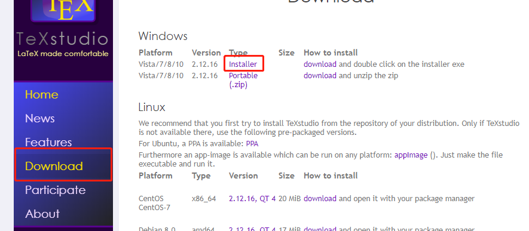
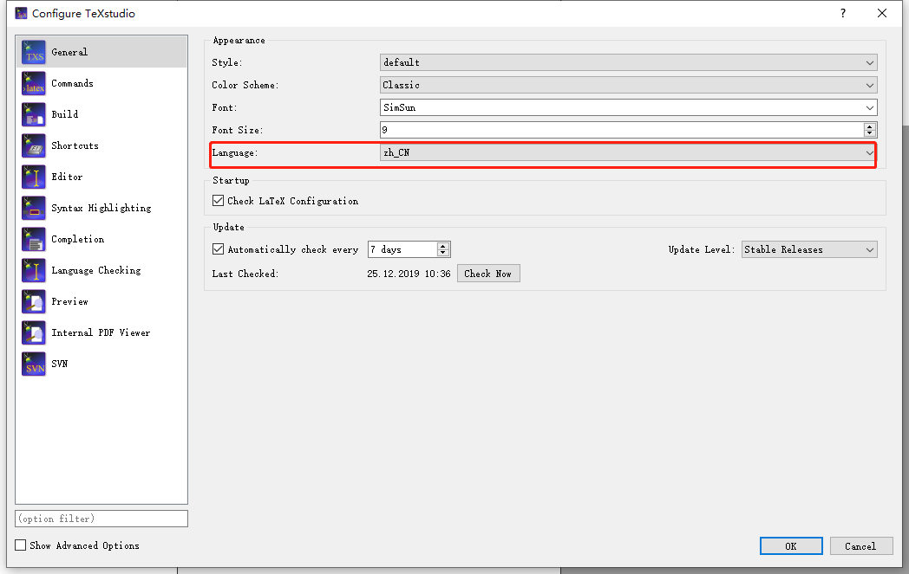
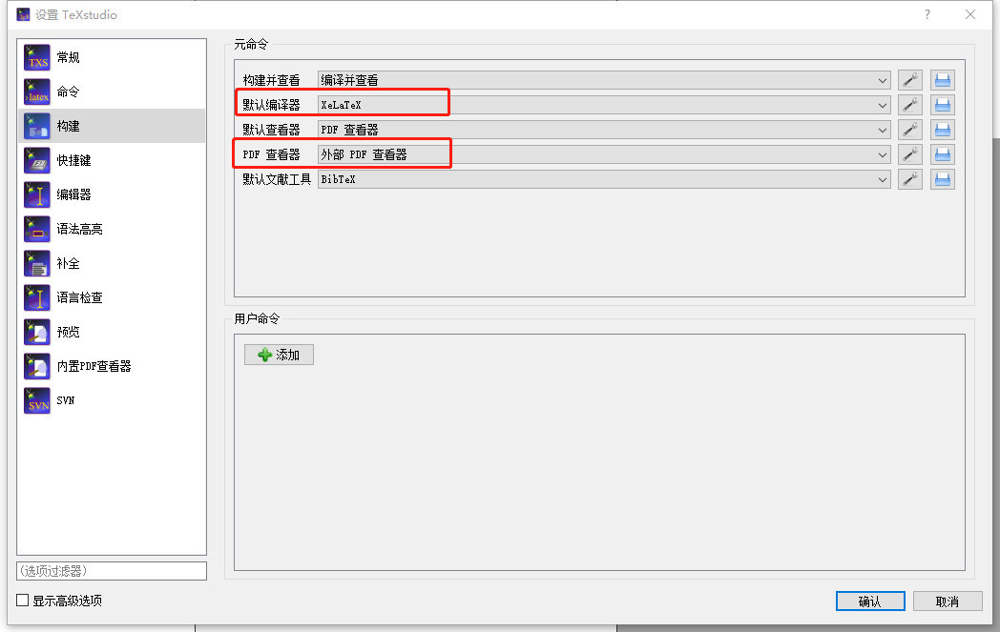
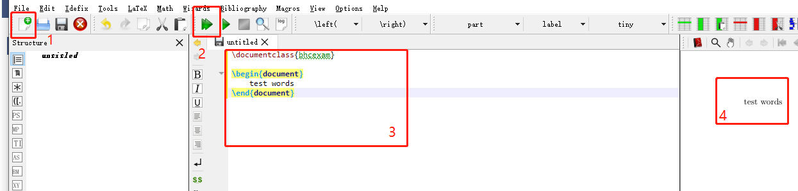

.. _texstudio:

----------------------
TeXstudio 简易使用指南
----------------------

简介
--------

**TeXstudio** 是一款开源的跨平台 :math:`\LaTeX` 编辑软件, 为用户提供了交互式拼写检查、代码折叠、语法高亮等特性但并没有集成编译 :math:`\LaTeX` 文件的功能，用户需另外安装 :math:`\LaTeX` 编译环境.

.. seealso:: **经验分享:** :ref:`how_to_install_texlive`

.. _texstudio_install:

TeXstudio 的安装
-------------------

访问 `TeXstudio官网 <https://www.texstudio.org/>`_ , 下载操作系统对应的安装包并安装：

.. _texstudio_config:

TeXstudio 的配置
-------------------

* 依次点击 ``Options->Configure->TeXStudio`` ，进入TeXstudio的配置页面.

* 点击 ``General`` ，将 ``language`` 修改为 ``zh_CN`` ，将主界面所有文字既已修改为中文.

* 点击 ``构建`` , 修改默认的编译器和PDF查看器.

.. _texstudio_usage:

TeXstudio 的使用
-------------------

打开TeXstudio，点击图中 ``1`` 处新建空白文件，在 ``3`` 处填入内容，然后点击 ``2`` 处的绿色双箭头进行编译(或者按 ``F5`` )，即可看到生成的PDF格式文档内容(如 ``4`` 处).

更多
-----------

* `官方用户手册 <http://texstudio.sourceforge.net/manual/current/usermanual_en.html>`_
