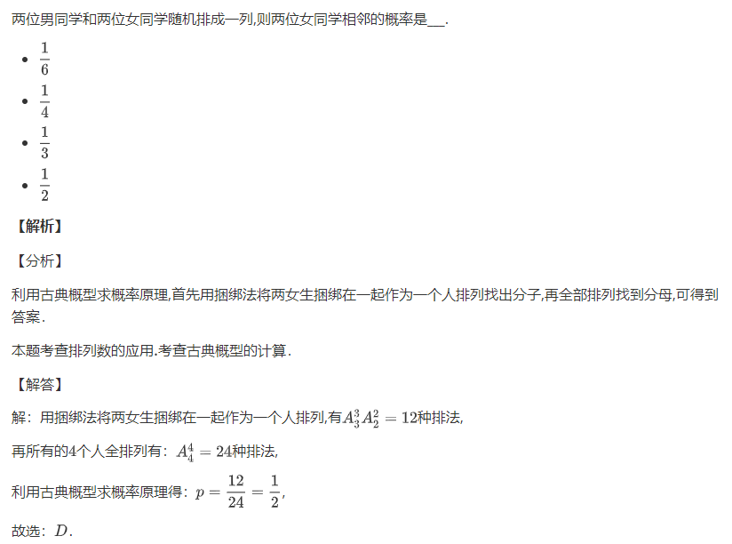

.. _typora_guide:

===============
Typora 使用指南
===============

``Typora`` 是一款支持实时预览的 ``Markdown`` 文本编辑器。它有 *OS X*、*Windows*、*Linux* 三个平台的版本，可以导入/导出多种格式的文档，是 **完全免费** 的. `下载地址 <https://www.typora.io/#windows>`_ 为: https://www.typora.io/#windows

`橘子数学 <https://www.mathcrowd.cn/index.php>`_ 网站提供了题目导出为 ``Markdown`` 格式的功能，可以将试题导出后，在 ``Typora`` 中编辑后导出为其他格式(docx,PDF等)或粘贴到 **公众号**.

------------
关于MarkDown
------------

**Markdown** 是用来编写结构化文档的一种纯文本格式，它使我们在双手不离开键盘的情况下，可以对文本进行一定程度的格式排版。你可以在 `这篇文章 <https://guides.github.com/features/mastering-markdown/>`_ 中快速入门.

标题
----
``Markdown`` 中插入标题的语法为::

#    一级标题
##   二级标题
###  三级标题

斜体&粗体
--------
``Markdown`` 中插入斜体和粗体文本的语法为::

*text*    斜体text
**text**  粗题text

图片
-------

``Markdown`` 原生插入图片的语法为::

在 ``Typora`` 中你可以在原生语法之外，还可以使用如下两种形式插入图片:

* 使用 ``复制/粘贴`` 将网络图片、剪贴板图片复制到文档中;
* 直接拖动本地图片到文档中

数学公式
--------------

``Markdown`` 支持 :math:`\LaTeX` 格式的数学公式::

$...$     行内公式
$$...$$   行间公式

.. note:: 行内公式需要在 ``文件-偏好设置-Markdown-Markdown扩展语法`` 中勾选 ``内联公式`` 复选框， 重启 ``Typora`` 后生效.

.. seealso:: **入门指南:** :ref:`latex_tutorial`
-------------------
橘子数学导出Markdown
-------------------
`橘子数学 <https://www.mathcrowd.cn/index.php>`_ 网站提供了题目导出为 ``Markdown`` 格式的功能.
在 `橘子数学 <https://www.mathcrowd.cn/index.php>`_ 试题编辑页面，点击右侧的 ``分享/导出 - 复制到Markdown编辑器`` 。打开 ``Typora`` ，切换到源代码模式( ``Ctrl + /`` )，粘贴，切出源代码模式( ``Ctrl + /`` )既可查看渲染效果:

.. image:: ../_static/md_ept.png

.. seealso:: **入门指南:** :ref:`problem_share`

----
导出
----

``Typora`` 支持导出多种格式文档，其中原生支持导出 ``HTML`` 和 ``PDF`` 文档，根据提示安装 ``pandoc`` 控件后还可以导出为 ``docx`` , ``tex`` 等多种格式

导出为 ``HTML``
--------------

``Typora`` 原生支持将文档导出为 ``HTML`` 格式的文件,一个实用的用处是将 ``橘子数学`` 中导出的试卷在 ``Typora`` 中调整 `CSS样式`_ ,导出 ``HTML`` 代码并直接黏贴到 **微信公众号** 后台.

CSS样式
---------

为了让文档更美观，我们可以为其加上 ``CSS style``.在 ``Typora`` 中 ``CSS`` 被称为 **「主题」**，你可以在 ``文件 - 偏好设置 - 外观 - 主题 - 打开主题文件夹`` 看到这些 ``CSS`` 文件.
Typora 自带了若干主题，你也可以在 `官网 <http://theme.typora.io/>`_ 下载更多的主题.

综上，结合 `橘子数学 <https://www.mathcrowd.cn/index.php>`_ 中 :ref:`problem_share` 提供的 ``导出Markdown`` 功能，可以帮助对 :math:`\LaTeX` 语法不太熟练，但是喜欢 :math:`\LaTeX` 公式排版样式的老师快速的生成一份美观的试卷.
