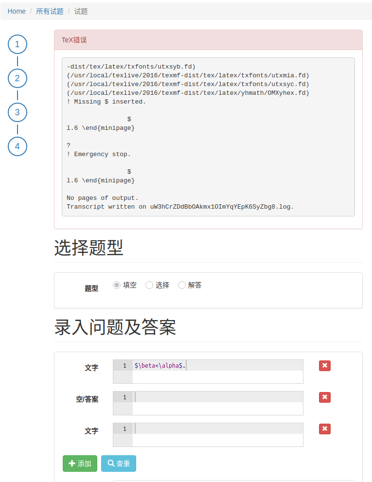

.. _common_error:

常见错误及解决汇总
========================

.. note:: 欢迎在 BHCexam 的 `Github 项目 <https://github.com/mathedu4all/bhcexam/issues>`_ 上提交 issue 指出宏包中的BUG或提出建议或寻求帮助. 详见 `项目wiki <https://github.com/mathedu4all/bhcexam/wiki>`_ .

含有下划线
----------------------

* 错误描述:

    网页预览正常，提交后提示缺 ``$`` .

    .. image:: ../_static/underline_error.png

* 原因分析:

    ``_`` 被误认为下标.

* 解决方法:

    将 ``____`` 替换为 ``\underline{\qquad}`` .

字体缺失
-----------------

* 错误描述：

    本地编译显示字体缺失错误.

    .. image:: ../_static/font_error.jpg

* 原因分析：

    宏包默认使用Adobe字体.

* 解决方法：

    在宏包选项中修改默认字体(见 :ref:`bhcexam_option` ).

    .. code-block:: latex

        \documentclass[windows]{BHCexam}

中文不正常显示
-----------------

* 错误描述：

    网页端显示正常，但生成的pdf里中文无法正常显示.

    .. image:: ../_static/chinese_math_tex.png
        :width: 600px

    .. image:: ../_static/chinese_math_pdf.png
        :width: 300px

* 原因分析：

    在数学环境里，:math:`\LaTeX` 默认使用数学字体，故在数学环境中出现中文，会发生缺少对应字体而无法显示的情况.

* 解决方法:

    数学环境中插入非数学公式文本时，使用 ``\text{普通文本}`` ,如:

    .. code-block:: latex

        $x=1\text{或}2$

特殊符号（如带圈数字等）不正常显示
--------------------------------------------

* 错误描述：

    网页端显示正常，但生成的pdf里中文无法正常显示.

* 原因分析：

    在数学环境里，:math:`\LaTeX` 默认使用数学字体，故在数学环境中出现特殊字符，会发生缺少对应字体而无法显示的情况.

* 解决方法：

    尽量使用 :math:`\LaTeX` 命令表示特殊符号，如用 ``\in`` 表示属于符号，而非 ``∈`` .

.. seealso:: **入门指南：** :ref:`latex_tutorial`

.. warning:: **关于带圈数字：** 橘子数学网站在线编辑时支持直接插入带圈数字(如 ``①`` )，但要求其不能出现在数学环境中.

显示缺失 ``$``
----------------------------------

* 错误描述:

    预览正常，编译无法通过.

* 原因分析:

    ``<`` 、 ``>`` 会触发转义，导致之后的代码被忽略.

* 解决方法：

    在 ``<`` 、 ``>`` 左右添加 ``空格`` 防止转义. 或者在数学环境中使用 ``\lt`` 、 ``\gt`` 代替.
